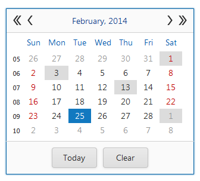

# Date Selection
Click a date to select it in the calendar. Click **Today** to select today's date. To clear the selection, click **Clear**.

## Multiple Date Selection
If multiple date selection is allowed by the application vendor, you can select dates in the following ways.
* Focus a date while holding the CTRL key to select or deselect the date without changing the other selection(s).
* Move focus using either the ARROW keys or the mouse while holding down the SHIFT key.
* Press and hold the left mouse button while moving it.