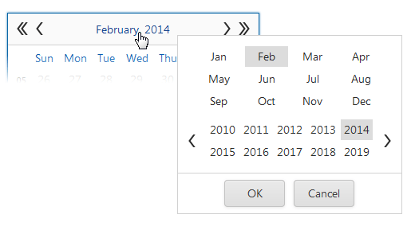

# Fast Navigation Window
The **Fast Navigation** window allows you to easily select a month and year to be displayed in the calendar. To display the Fast Navigation window, click the calendar header text. To hide the window, click **OK** or **Cancel**, click outside the window, or press the ESC key.

## Keyboard Support
| Key Combination | Action |
|---|---|
| LEFT ARROW | Moves the selected year one year back |
| RIGHT ARROW | Moves the selected year one year forward |
| UP ARROW | Moves the selected year five years back |
| DOWN ARROW | Moves the selected year five years forward |
| SHIFT+LEFT ARROW | Moves the selected month one month back |
| SHIFT+RIGHT ARROW | Moves the selected month one month forward |
| SHIFT+UP ARROW | Moves the selected month four months back |
| SHIFT+DOWN ARROW | Moves the selected month four months forward |
| PAGE UP | Moves the selected year ten years back |
| PAGE DOWN | Moves the selected year ten years forward |
| ENTER | Applies changes |
| ESC | Cancels changes and closes the Fast Navigation window |