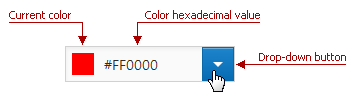
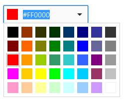
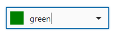
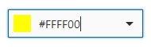
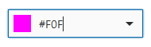
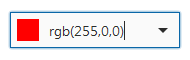

# Color Edit
The Color Edit is used to specify a color. The editor displays the current color and its hexadecimal value.

Click the drop-down button to display the drop-down color palette.

## Specifying a color in the Color Edit
Using the Color Edit, you can specify a color in the following ways.

**Using the color palette**

To select a color, click it in the drop-down color palette.

**Using the text edit**

You can specify the color by typing it directly in the editor's text box. Note that in this case you can specify custom colors that are not displayed in the drop-down palette. You can specify a color in the following color formats.

| Format | Examples | Image | Description |
|---|---|---|---|
| HTML color name | RED, aquamarine, DarkViolet |  | Standard HTML color names. |
| Longhand hexadecimal notation | #00FFFF, 2fa135, #abcdef |  | #RRGGBB, where RR is red, GG is green, and BB is blue. These hexadecimal integers specify the components of the color. All values must be between 0 and FF. The hash (#) sign can be skipped. |
| Shorthand hexadecimal notation | #0FF, 21f, #afa |  | #RGB, where R is red, G is green, and B is blue. These hexadecimal integers specify the components of the color. All values must be between 0 and F. The hash (#) sign can be skipped. |
| RGB format | rgb(143,26,225), RGB(255,255,0), rgb(0,0,0) |  | RGB(red, green, blue). Each parameter (red, green, and blue) defines the intensity of the color and must be an integer between 0 and 255. |

> [!NOTE]
> If you specify the wrong value, the editor returns the last correct value.