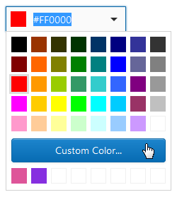
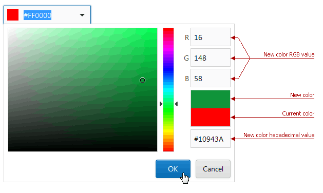

# Custom Color Picker
The **Custom Color Picker** allows you to select a custom color using a graphical interface.

To display the color picker, click the **Custom Color...** button.

In the invoked drop-down window, select a color and click **OK**. The color will be added to the custom color palette, which is displayed under the **Custom Color...** button.