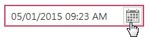
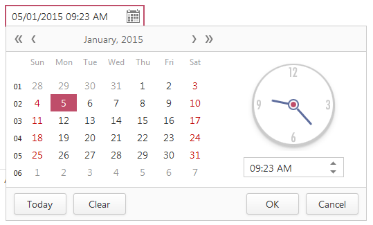
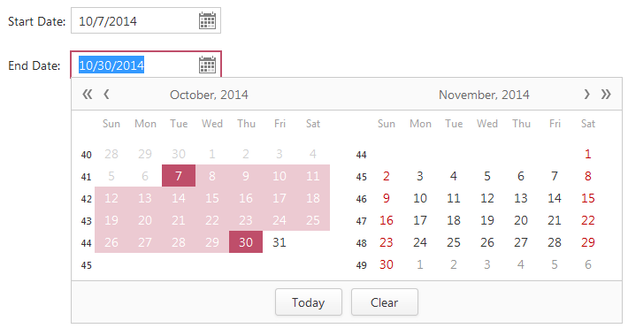

# Date Edit
The Date Edit is used to specify a date and time.

Click the drop-down button to display a drop-down window containing a [calendar](calendar.md) and time section.

## Specifying a date in the Date Edit
To specify a date in the Date Edit, do one of the following.
* Click a date in the drop-down [calendar](calendar.md).
* Type a date directly in the editor's text box.

## Date Range Picker
A date range picker is used to specify a date range. The picker is implemented by two Date Edits.

To specify a date range, do the following.
* Select a start range date in ”Start Date”.
* Select an end range date in ”End Date”.