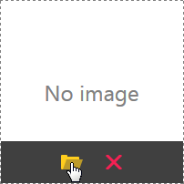
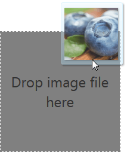
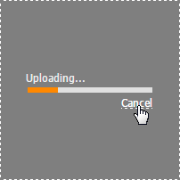

# Image Uploading
Click the **Upload Image** button to invoke the **File Upload** dialog. In the dialog, select an image to be uploaded and click **Open**.

You can upload image by dropping it to the image area as well.

You can cancel file uploading process by clicking the **Cancel** button.

To change the current image, click the **Upload Image** button. To remove the image, click the **Clear** button.

