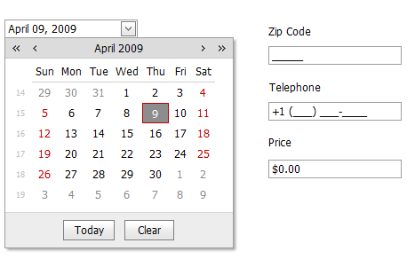

# Masked Input
Masked input functionality is available for the text and date editors. It allows end users to enter the string in the specified format. For instance, a text editor shall accept date/time values in the 24-hour format only, or only numeric values, or a phone number that only allows an end-user to enter digits into automatically constructed placeholders.

> [!NOTE]
> The keyboard and mouse wheel can be used to incrementally modify portions of the edit value.