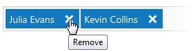
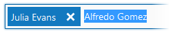

# Token Box
The Token Box allows you to select values using a predefined value list.

## How to Add a Token
You can add a token in the following ways.
* Type the token name in the Token Box. To end a token input, type a comma (,) or semicolon (;) character, press the ENTER key, or click an area outside of the Token Box.
* Select a token from the predefined token list in the drop-down window. Start typing a token name to filter the list of values according the typed text. You can navigate through values using the UP ARROW and DOWN ARROW keys, or by using the mouse scroll wheel. To select a token press the ENTER key or click the desired value.

Note that tokens must be unique, so you cannot add the same tokens twice.

## How to Remove a Token
To remove a token, click the **Remove** button.

You can remove the last token by pressing the BACKSPACE key when the Token Box is focused. The last token will be displayed as the selected text, and you can remove it by pressing the DELETE key.

