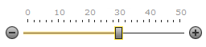
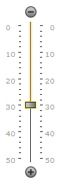

# Track Bar
You can select a value within the Track Bar by positioning the drag handle within a range of values limited by a developer. The drag handle position can be changed in the following manner:
* **By clicking on the track or scale**
	
	You can click the track or scale in the desired place in order to change the track bar value.
	
	[See animation](track-bar/track-and-scale-clicks.md).
* **By clicking on decrement and increment buttons**
	
	You can click increment and decrement buttons in order to change the drag handle position.
	
	[See animation](track-bar/change-buttons-clicks.md)
* **Via the mouse wheel**
	
	If a track bar is in focus, you can scroll the mouse wheel in order to change a drag handle position.
* **By dragging the handles**
	
	You can drag the handle and drop it at the required position.
	
	[See animation](track-bar/drag-handle-drag-n-drop.md).
* **By pressing arrow keys**
	
	If the track bar is in a horizontal orientation mode, end-users can use left/right arrows to change the track bar value, if in a vertical orientation mode - up/down arrows.
	
	| Horizontal Mode | Vertical Mode |
	|---|---|
	|  |  |
* **Bar Highlight moving**
	
	If the track bar is in a range selection mode, you can select a range of values instead of a single value. The track bar control provides you with the ability to move the selected range along the track by dragging the track highlighted part called bar highlight.
	
	[See animation](track-bar/dragging-bar-highlight.md).

Note that the track bar control automatically marks the last clicked handle as focused and highlights it by default. You can change its position using arrow keys, increment/decrement buttons and the scroll wheel. Note that a click on the track or a scale changes the position of the nearest drag handle.