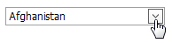
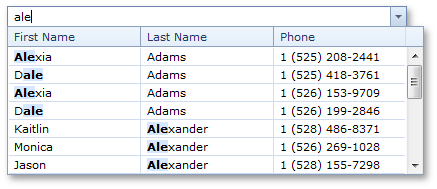

# Work with Dropdown Editors
## Open Editor's Dropdown
* Focus the editor and press ALT+DOWN ARROW or ALT+UP ARROW .
* Click the editor's dropdown button.
	
	

## Close Editor's Dropdown
For all editors providing a dropdown, you can close the dropdown by pressing ALT+DOWN ARROW, ALT+UP ARROW or ESC.

Dropdowns displaying lists of items can be closed by clicking on an item with a mouse, or by selecting an item with a keyboard and pressing ENTER.

## Filter Editor's Dropdown Content
To filter data within a dropdown, type the filter condition within an editor. Note that the filter is used after the minimum number of characters has been typed within an editor.

