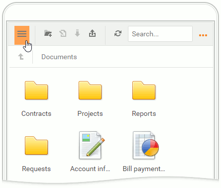
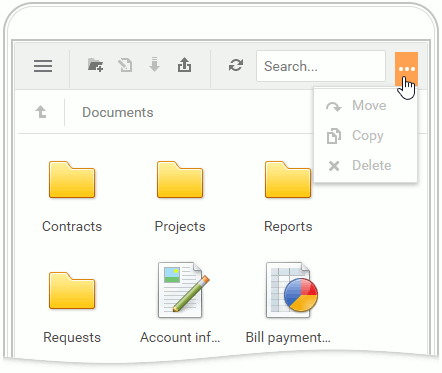
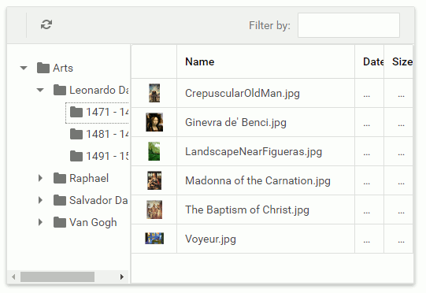

# Adaptive Layout

The file manager's elements are automatically rearranged when the browser window is resized. 

## Folder Container

Click the hamburger button to expand/collapse the folder container in the toolbar's left side.

## Toolbar

The file manager automatically resizes or hides the toolbar items in the popup menu hidden under the ellipsis button. Click the ellipsis button to show the hidden items.

## File Container

The file container grid automatically hides columns one by one when the browser window is resized. 

