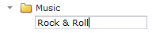
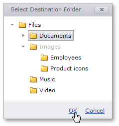

# File and Folder Editing
## Create a Folder
To create a new folder:
* Select the folder in which you wish to create a child folder.
* Click the **Create** button () or press F7.
* Type the new folder name.
	
	

## Rename Files and Folders
To rename a file or folder:
* Select the file/folder you wish to rename.
* Click the **Rename** button () or press F2.
* Type the new folder name.

## Move Files and Folders
To move a file or folder:
* Select the file/folder you wish to move.
* Click the **Move** button () or press F6.
* Select the folder in which you wish to move the file/folder and click **OK**.
	
	

## Copy Files and Folders
To copy a file or folder:
* Select the file/folder you wish to copy.
* Click the **Copy** button ().
* Choose the folder to which you wish to copy the file/folder and click **OK**.
	
	

## Delete Files and Folders
To delete a file or folder:
* Select the file/folder you wish to delete.
* Click the **Delete** button () or press the DELETE key.