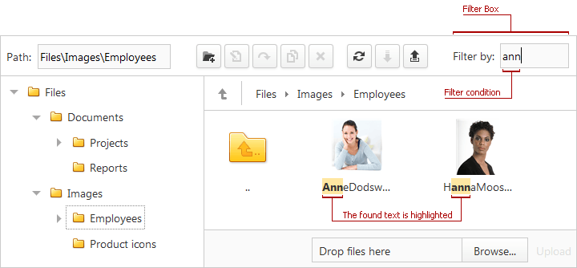

# Filtering Files
You can filter file manager items within the current folder and subfolders. 
* Type text in the filter box to filter files or change the filter conditions.
* Clear the text from the filter box to remove a filter.

