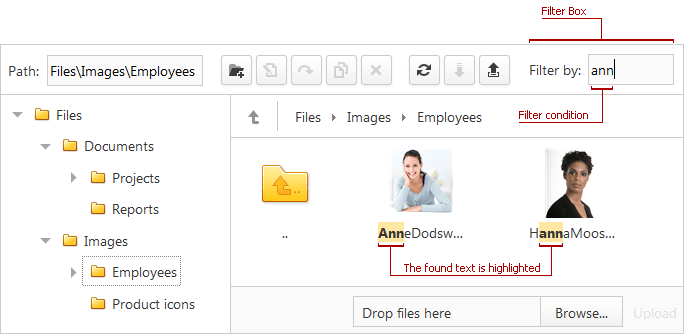

# Filtering Files
End-users can filter file manager items within the current folder and all subfolders. 
* To filter files or change the filter conditions type text within the Filter Box.
* To remove a filter, clear the text from the **Filter Box**.

