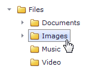

# Uploading Files
To upload files by a file manager do the following.
* Click **Browse**.
	
	
* Select a file you want to upload. Its name is shown in an editor.
	
	
* Select a folder into which you want to upload the file.
	
	
* Click **Upload**.
	
	