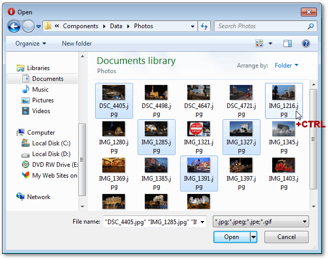
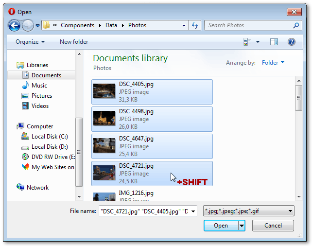
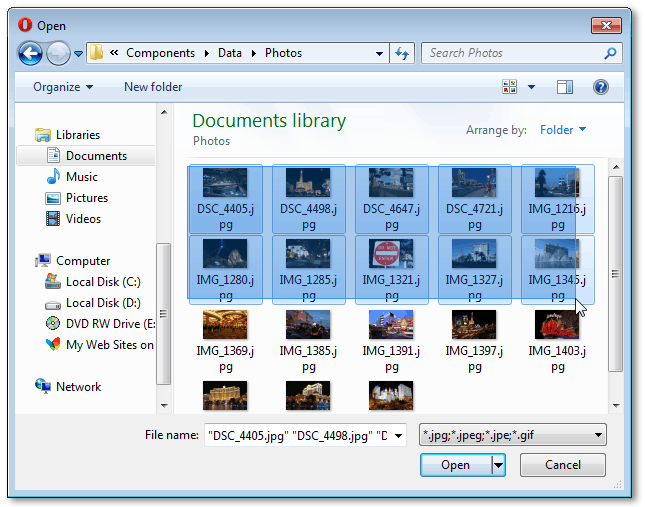

# Multi-File Selection
You can upload several files at once if multiple file selection is allowed by the application vendor.

Click **Browse** to invoke the file chooser.

You can select multiple files by doing one of the following.
* Click a file while holding the CTRL key. This toggles a file's selected state without affecting other files.
	
	
* To select all files between the clicked file and the previously focused file, click a file while holding the SHIFT key. In this case, the previous selection is cleared.
	
	
* To select a consecutive group of files without using the keyboard, drag the mouse pointer around the outside of all the files you want to include to create a selection.
	
	

After required files are selected, click **Open** to add them to file upload list.