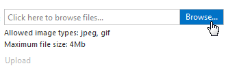
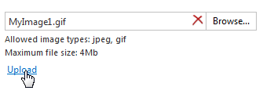

# Uploading a Single File
To select a file, click **Browse** or the input area, and select a file within the invoked **Choose File** dialog.

As a result, the selected file's name is placed into the edit box. Then, click **Upload** to upload the selected file to the server.

