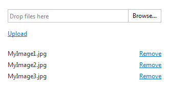
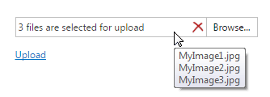

To upload multiple files, do one of the following.
* Select a file for upload within a file input using the **Browse** button.
	
	
	
	Use the **Add** button to add a file input to the File Upload.
	
	Use the **Remove** button to delete a file input from the File Upload.
* Click the **Browse** button and select [multiply files](../../../interface-elements-for-web/articles/file-upload-control/multi-file-selection-.md), or drag the required files to File Upload.
	
	
	
	The selected files will be displayed in a file list or within the file input tooltip.
	
	

Then, click **Upload** to upload the selected files to the server.