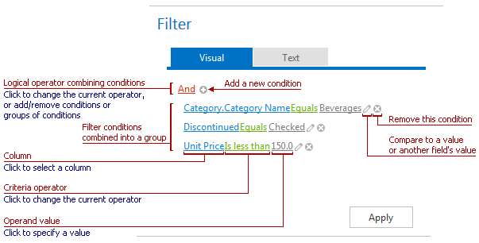
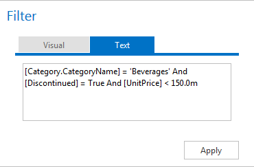

# Filter Editor
The Filter Editor is used to edit filter criteria. Use the **Add**  and **Remove**  buttons to create and customize filter criteria.

Switch to the **Text** tab to edit filter criteria in text view.

The following sections describe  how to add, change and delete filter conditions.
* [Create New Conditions in Filter Editor](filter-editor/create-new-conditions-in-filter-editor.md)
* [Change Conditions in Filter Editor](filter-editor/change-conditions-in-filter-editor.md)
* [Delete Conditions in Filter Editor](filter-editor/delete-conditions-in-filter-editor.md)