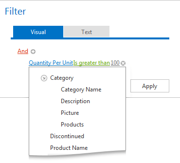
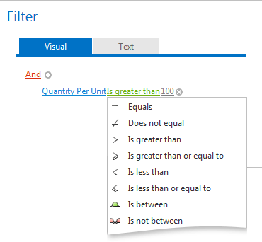
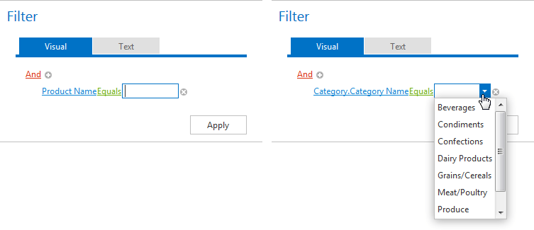

# Change Conditions
You can modify the manner that filter conditions change the columns in a filter.

**Change a Column in a Filter Condition**

To change a condition's column, invoke the column list by clicking the current column. Then, choose the required column from the list that will be invoked.

**Change an Operator in a Filter Condition**

To change a condition's operator, invoke the operator list by clicking the condition's current operator. Then, choose the required operator from the list that will be invoked.

**Edit a Condition's Value**

To edit a condition's value, click the operand value and type text. To discard changes to the value and close the active edit box, press ESC.

