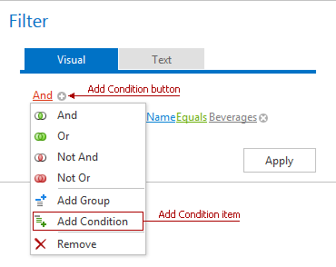
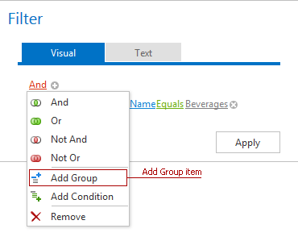

# Create New Conditions
To add a condition to a logical group, do one of the following:
* Click the **Add**  button for the group.
* Click the group's logical operator and select **Add Condition**.

To add a group of conditions to another group, click the group's logical operator and select **Add Group**.

