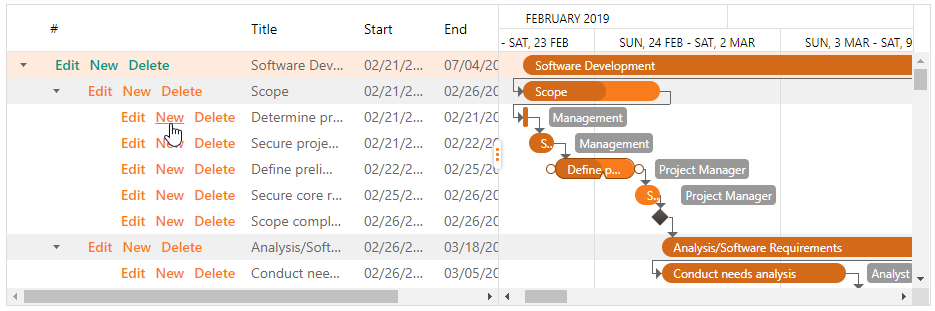
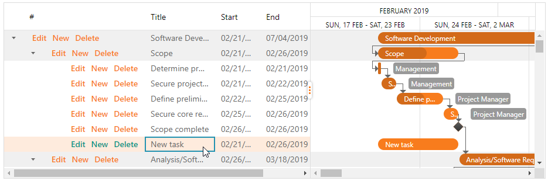

# Modify Tasks

## Add a Task

To create a new task:

* Click the **New** button in the task list or the **Add** item in the context menu.

    

    This action adds a new task to the end of the task list at the **next** hierarchical level.

    

* Specify data for a task. Double click each cell in the task list to specify a task subject, start and end dates.

    <image>
    
    Double click a task in the Gantt chart to invoke the "Task Details..." dialog window where you can specify the task's progress and associated resource in the "Task Information" and "Resources" dialogs.

    <image>

    You can also move a task and use its resize handlers to change a task's start date, end date and duration directly in the chart area.

    <image>

* Specify a task's dependencies. Hover over a task, press its start or end point and drag to another task. Note that the drag direction defines a dependency type. 

    <image>

## Edit a Task

In the task list, double click a task cell to edit the task's title, start and/or end date. 

<image>

In the Gantt chart, double click a task or use the context menu to invoke the "Task Details..." dialog window where you can edit the task's information (title, start and end dates, associated resources and progress).

<image>

To change the task dependencies, first delete existing dependencies. Then press the task's start or end point and drag to another task to create new dependencies. Note that the drag direction defines a dependency type. 

<image>

You can also move a task and use its resize handlers to change a task's start date, end date and duration directly in the chart area.

<image>

## Delete a Task

* Click the **Delete** button in the task list or use the **Remove Task** context menu item to delete a task. Note that this action also removes dependencies associated with the deleted task.

<image>

