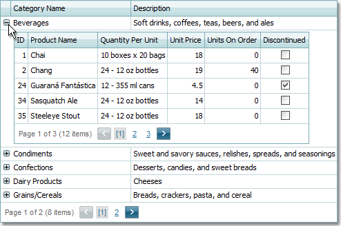

# Grid

This section describes Grid control capabilities. A grid represents data in tabular form, and supports data editing, sorting, grouping, filtering, summary calculation, column resizing, data export and data cell bands.

**Data Editing**
* [Add and Delete Rows](grid/data-editing/add-and-delete-grid-rows.md)
* [Switch a Grid to Edit Mode](grid/data-editing/switch-a-grid-to-edit-mode.md)
* [Save or Discard Changes when Editing Rows](grid/data-editing/save-or-discard-changes-when-editing-grid-rows.md)
* [Batch Editing](grid/data-editing/batch-editing.md)

**Selection and Navigation**
* [Page Navigation](grid/selection-and-navigation/page-navigation-in-grids.md)
* [Select Rows](grid/selection-and-navigation/select-grid-rows.md)
* [Keyboard Navigation](grid/selection-and-navigation/keyboard-navigation.md)

**Sorting**
* [Sort Grid Rows](grid/sorting/sort-grid-rows.md)

**Grouping**
* [Group Grid Rows](grid/grouping/group-grid-rows.md)
* [Expand and Collapse Group Rows](grid/grouping/expand-and-collapse-group-rows.md)

**Filtering**
* [Filtering Grid Data](grid/filtering/filtering-grid-data.md)
* [Date Range Header Filter](grid/filtering/date-range-header-filter.md)
* [Search Panel](grid/filtering/search-panel.md)
* [Creating Complex Filter Criteria with the Filter Builder](grid/filtering/creating-complex-filter-criteria-with-the-filter-control.md)

**Context Menu**
* [Context Menu](grid/context-menu/context-menu.md)

**Layout Customization**
* [Resize Columns](grid/layout-customization/resize-columns.md)
* [Hide and Display Columns](grid/layout-customization/hide-and-display-grid-columns.md)
* [Reorder Columns](grid/layout-customization/reorder-grid-columns.md)

**Customization Dialog**
* [Customization Dialog](grid/customization-dialog/customization-dialog.md)
* [Sorting Page](grid/customization-dialog/sorting-page.md)
* [Grouping Page](grid/customization-dialog/grouping-page.md)
* [Filtering Page](grid/customization-dialog/filtering-page.md)
* [Column Chooser Page](grid/customization-dialog/column-chooser.md)

**Data Summaries**
* [Data Summaries](grid/data-summaries.md)

**Data Validation**
* [Data Validation](grid/data-validation.md)

**Data Export**
* [Data Export](grid/data-export.md)

**Responsive Layout**
* [Responsive Layout](grid/responsive-layout/responsive-layout.md)

**Grid Lookup**
* [Grid Lookup](grid/grid-lookup/grid-lookup.md)
* [Filter Grid Lookup Data](grid/grid-lookup/filter-grid-lookup-data.md)
* [Select Grid Lookup Rows](grid/grid-lookup/select-grid-lookup-rows.md)
