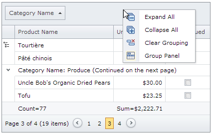
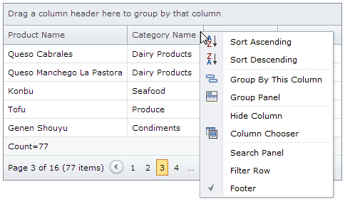
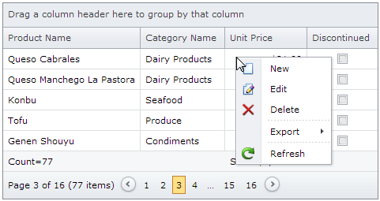
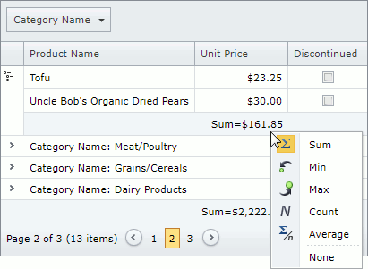
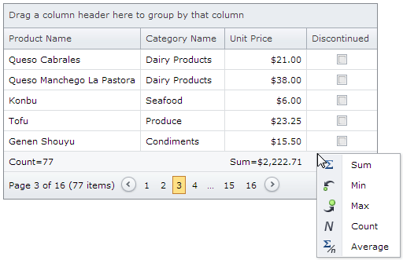

# Context Menu
The **context menu** is a menu displayed when you right-click a grid element.

A context menu can be displayed for the following elements: [group panel](#grouppanelmenu), [column header](#column-menu), [row](#row-menu), [group footer](#groupfooter-menu), and [footer](#footer-menu).

Context menu commands can be hidden or unavailable, based on the current grid settings.

## <a name="grouppanelmenu"/>Group Panel Menu
Right-click a group panel to display the group panel menu.

The table below lists the group panel menu commands.

| Command | Description |
|---|---|
| Expand All | Expands all group rows. |
| Collapse All | Collapses all group rows. |
| Clear Grouping | Clears grouping in the group panel. |
| Group Panel | Shows and hides the group panel. |

## <a name="column-menu"/>Column Header Menu
Right-click the column header to display the column header menu.

The table below lists the column header menu commands.

| Command | Description |
|---|---|
| Clear Filter | Clears the current column filter. |
| Clear Sorting | Clears the current column sorting. |
| Collapse All | Collapses all group rows. |
| Expand All | Expands all group rows. |
| Group by This Column | Groups grid data by the current column. |
| Hide Column | Hides the current column. |
| Show Column | Shows a column in the grid. |
| Show Customization Dialog | Shows the customization dialog. |
| Column Chooser | Shows and hides the column chooser. |
| Filter Builder... | Shows and hides the filter builder. |
| Filter Row | Shows and hides the filter row. |
| Filter Row Menu | Shows and hides the filter row menu. |
| Footer | Shows and hides the footer. |
| Group Panel | Shows and hides the group panel. |
| Search Panel | Shows and hides the search panel. |
| Sort Ascending | Sorts grid data by the current column ascending. |
| Sort Descending | Sorts grid data by the current column descending. |
| Ungroup | Ungroups grid data by the current column. |

## <a name="row-menu"/>Row Menu
Right-click a row or a group row to display the row menu.

The table below lists the row menu commands.

| Command | Description |
|---|---|
| Collapse Detail | Collapses the current detail row. |
| Collapse | Collapses the current group row. |
| Delete | Deletes the current data row. |
| Edit | Turns the edit mode on for the current row. |
| Expand Detail | Expands the current detail row. |
| Expand | Expands the current group row. |
| Export | Allows to export grid data to different formats. |
| Group Summary | Allows to show and hide group row summary items. |
| New | Creates a new row. |
| Refresh | Refreshes grid data. |

## <a name="groupfooter-menu"/>Group Footer Menu
Right-click a group footer to display the group footer menu.

The table below lists the group footer menu commands.

| Command | Description |
|---|---|
| Average | Shows and hides the average cell value in the current column. |
| Count | Shows and hides the count of the current column cell values. |
| Max | Shows and hides the maximum cell value in the current column. |
| Min | Shows and hides the minimum cell value in the current column. |
| Sum | Shows and hides the sum of the current column cell values. |
| None | Hides every summary item. |

## <a name="footer-menu"/>Footer Menu
Right-click a footer to display the footer menu.

The table below lists the footer menu commands.

| Command | Description |
|---|---|
| Average | Shows and hides the average cell value in the current column. |
| Count | Shows and hides the count of the current column cell values. |
| Max | Shows and hides the maximum cell value in the current column. |
| Min | Shows and hides the minimum cell value in the current column. |
| Sum | Shows and hides the sum of the current column cell values. |
| None | Hides every summary item. |