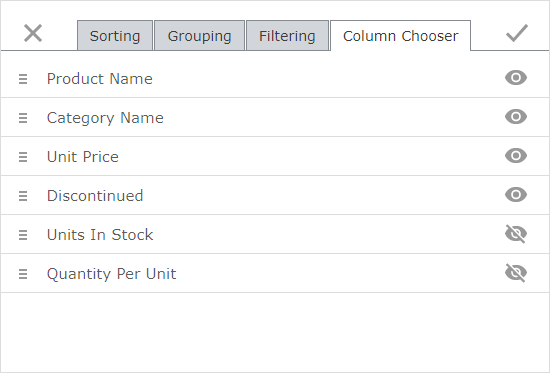

# Column Chooser Page

You can use the **Column Chooser** page to change data columns' order and visibility.

Click  to hide the corresponding column in a grid.

Click the  to show the corresponding column in a grid.

 Use  to drag columns and change their order in a grid.

You can modify dialog settings and click **Apply**  or click **Close**  to discard all the changes.
