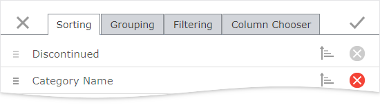

# Customization Dialog

You can use the customization dialog to perform data shaping operations.

The following pages are available within the dialog:
* [Sorting](sorting-page.md) page enables you to sort grid data, change the sorting order (ascending/descending), and change the order of sorted columns.
* [Grouping](grouping-page.md) page enables you to group grid data and change the grouping priority order.
* [Filtering](filtering-page.md) page enables you to filter grid data.
* [Column Chooser](column-chooser.md) page enables you to change data columns' order and visibility.

Click a tab to switch to the corresponding page.

You can modify dialog settings on every page and click **Apply**  or click **Close**  to discard all the changes.

 

