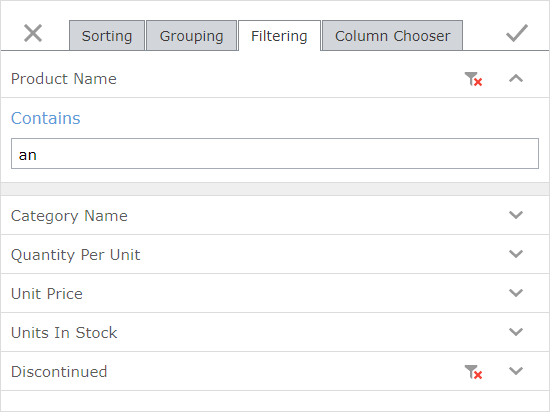

# Filtering Page
You can use the **Filtering** page to create and change filter conditions. 

You can select the criteria operator and specify the operand value for each column.

* Use  to expand a column's filter condition.
* Click  or clear an operand value's editor to remove a column's filter.

Click a column's criteria operator to display a list of available operators. Click a new operator to change the current one.

You can modify dialog settings and click **Apply**  or click **Close**  to discard all the changes.