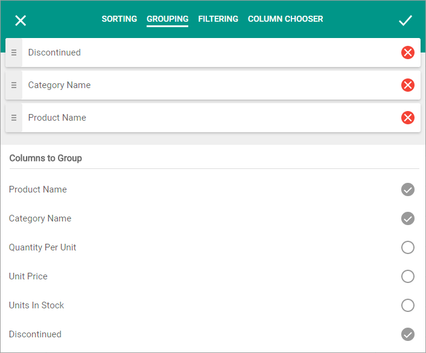

# Grouping Page
You can use the **Grouping**  page to group grid data and change grouping priority order.

Select a column's check box in the **Columns to Group** list to group grid data against this column.  You can group grid data by more than one column. The selected columns are displayed at the top of the **Grouping** page.
* Use  to drag the columns in this list and change the grouping priority order.
* Use  or clear a column's check box in the **Columns to Group** list to remove the column from the grouping list.

You can modify dialog settings and click **Apply**  or click **Close**  to discard all the changes.