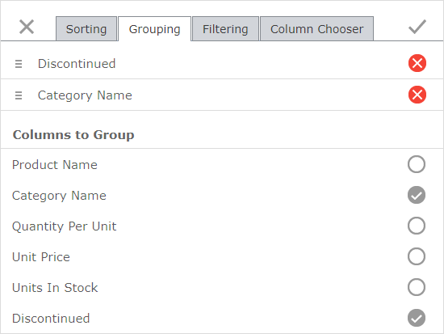

# Grouping Page
The **Grouping** page enables you to group grid data and change the order of grouping columns within the grid.

Select a column's check box in the **Columns to Group** list to group grid data against this column.  The grid data can be grouped by more than one column; a list of the grouped columns is displayed at the top of the **Grouping** page.
* Use  to drag the columns in this list and change the grouping priority.
* Use  or clear a column's check box in the **Columns to Group** list, to remove a column from the grouping list.

Click the **Apply** () or **Close** () button to apply or discard the changes, respectively.
