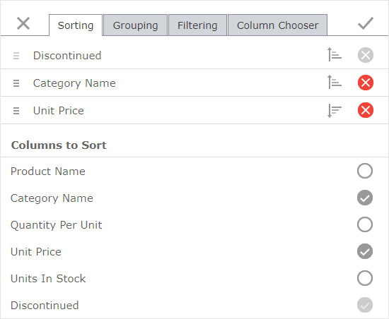

# Sorting Page
You can use the **Sorting**  page to to sort grid data, change the sorting order, and change the order of sorted columns.

Select a column's check box in the **Columns to Sort** list to sort grid data against this column in ascending order. The grid can be sorted more than by one column. A list of the sorted columns is displayed at the top of the **Sorting** page.

* Use  to drag the columns in this list and change the sorting priority.
* Use  to reverse a column's sort order.
* Use  or clear a column's check box in the **Columns to Sort** list to remove a column from the sorting list.

A grouping column is always sorted, therefore its remove button is displayed disabled. You can see the list of grouping columns in the [Grouping](grouping-page.md) dialog page.

You can modify dialog settings and click **Apply**  or click **Close**  to discard all the changes.

 
