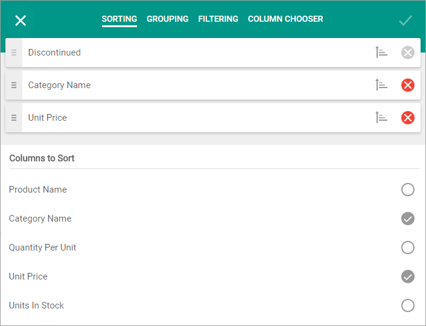

Select a column from the "Columns to Sort" list to sort grid data against this column in ascending order. The grid can be sorted more than by one column, and a list of the sorted columns is displayed at the top of the **Sorting** page.
* Use  to drag the columns in this list and change the sorting priority.
* Use  to reverse a column's current sort order.
* Use  to remove a column from the sorting list.

Click the "Apply" or "Close" button to apply or discard the changes, respectively.