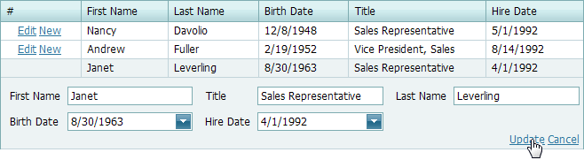
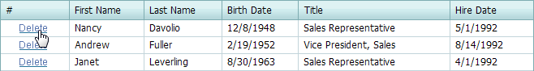

# Add and Delete Rows
## Add a Row
To create a new row:
* Click **New**.
	
	
* Specify cell values.
* Click **Update**.
	
	

## Delete a Row
To delete a row, click **Delete** within the row to be deleted.

> [!NOTE]
> Row management links may be unavailable in your application. This is the choice of the application vendor.