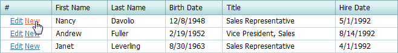

# Add and Delete Grid Rows
## Add a Record
To create a new record:
* Click **New**.
	
	
* Specify cell values.
* Click **Update**.
	
	

## Delete a Record
To delete a record, click **Delete** within the row to be deleted.

> Records management links may be unavailable in your application. This is the choice of the application vendor.