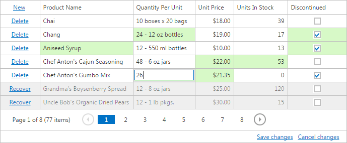

# Batch Editing
The Grid allows you to edit a group of grid records (on a single page) and save these changes with one click. In this view, you can create new rows, delete existing rows and edit individual cell values.
* To create a new row, click **New** and specify the field values.
* To delete a row, click **Delete** within the row to be deleted.
* To focus a cell and edit the value of a cell, use one of following approaches available depending on settings made by your application vendor.
	* Click on the cell to focus it and edit its value.
	* Click on the cell to focus it. Double-click on the focused cell to edit it.
	* Click on the cell to focus it. Click on the focused cell to edit it.

You can navigate through cells and edit cell values using the keyboard.

**Navigation**
* Use the TAB and SHIFT+TAB keys to move focus forward and backward. The edit state will be preserved for the next cell.
* Use the arrow keys to move focus between cells.

**Editing**
* Use the ENTER key to edit the focused cell.
* Use the ESC key to finish editing of the focused cell.
* Use the ENTER key to move focus ahead of the edited cell. The edit state will be preserved for the next cell.

The cells that were modified are highlighted in a different color. To save all changes, click **Save changes**. To cancel all changes, click **Cancel changes**.

If a Grid contains unsaved data, a confirmation message is displayed before the data is lost (e.g., when sorting the data, changing the grid page or closing the web page).

Click **OK** to cancel all data changes and proceed with the action, or click **Cancel** to cancel the action.