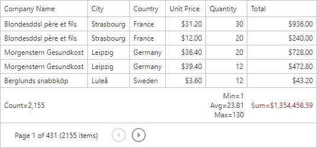
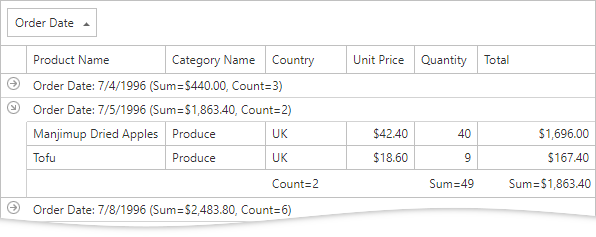
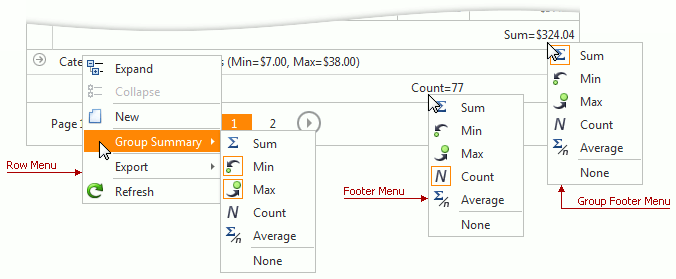

# Data Summaries

The grid can calculate and displays summaries about groups of rows or individual data columns. The following aggregate functions are available:
* Average
* Count
* Max
* Min
* Sum

The grid supports two summary types: total and group summary.

## Total Summary
A total summary calculates the value of an aggregate function over all the rows within a grid and is displayed within the footer.

  

## Group Summary
A group summary calculates the value of an aggregate function over all rows within a group and is displayed in the group row or group footer.

  

## Add and remove summaries
Use the [context menu](context-menu/context-menu.md) to add and remove summaries.

| Context menu item | Description |
|---|---|
| Sum |	Shows/hides a sum of cell values |
| Min |	Shows/hides the minimum cell value |
| Max |	Shows/hides the maximum cell |
| Count	| Shows/hides a count of cell values |
| Average |	Shows/hides the average cell value |
| None	| Hides all summaries in the current column |

  

 

