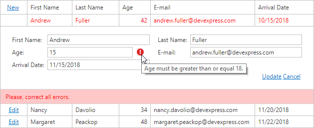

# Data Validation

The grid validates entered values and if a value doesn't pass validation, displays errors.

An error icon indicating the invalid value. Hover your mouse over the icon to display a hint along with a description of the error.

Correct every invalid value to save data. 

 

