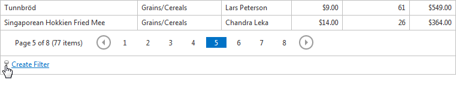
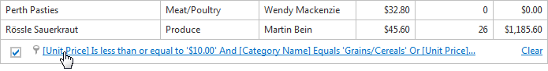

# Creating Complex Filter Criteria with the Filter Builder
To build complex filter criteria with an unlimited number of filter conditions, combined by logical operators, use the built-in Filter Builder.

To open the Filter Builder, click one of the following.
* the filter image displayed within the filter bar.
	
	
* the filter expression link.
	
	

To create and customize filter criteria, use the  and  buttons.

**Remarks**

A filter condition group is a set of conditions combined by the same logical operator. The following filter expression contains two groups combined by the logical **OR** operator: "(Country Equals 'UK' And Category Equals 'Beverages') Or (Country Equals 'USA' And Category Equals 'Produce')". In the Filter Builder, it is represented as follows.

To learn more, see the [Filter Editor](../../filter-editor.md) topic.