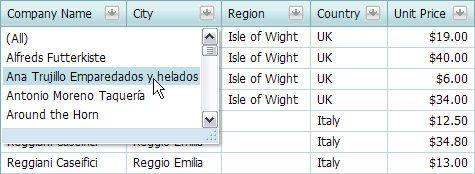
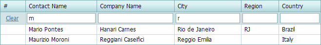

# Filtering Data
Grid provides different elements that allow you to filter data.

**Filter Buttons**

Click a filter button to invoke a filter drop-down list that contains unique values in a column.

You can use the check boxes in the drop-down list to select values and click **OK** to apply the filter criteria.

If the drop-down list does not display check boxes, click the required value to apply the filter criteria.

The drop-down list displays values that match the applied filter criteria. To remove the filter, click **(All)**.

Note that if a filter is applied to a column, other column header filters display the sorted rows' unique values. You can press SHIFT and click a header filter button to show all the values (including hidden rows' values).

The drop-down box displays a [date range editor](date-range-header-filter.md) for columns containing date and time data.

**Filter Row**

Type text within the **Filter Row**. A filter condition is automatically created based on the value entered, and this is applied to the corresponding column.

If the **Apply** button is displayed, the filter is applied on button click.

To remove the column filter, clear the text in the auto-filter row. To remove the grid's entire filter, click **Clear**.

**Search Panel**

Use the [Search Panel](search-panel.md) to filter data and highlight search results.

**Filter Builder**

Use the [Filter Builder](creating-complex-filter-criteria-with-the-filter-control.md) to create complex filter criteria.

**Customization Dialog**

Use the customization dialog's [Filtering page](../customization-dialog/filtering-page.md) to apply filter criteria to grid data.
