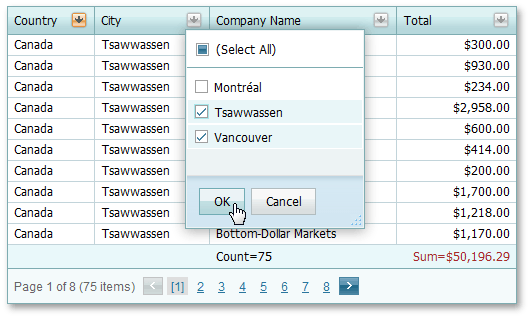
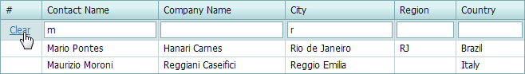

# Filtering Grid Data
To filter data or change the filter conditions in the grid, use one of the following.

**Filter Buttons**

Click a filter button to invoke the filter dropdown, which lists unique values in a column.

If the dropdown displays check boxes, check them to select the required values, and click **OK** to apply the filter criteria.

If the dropdown does not display check boxes, click the required value to apply the filter criteria.

If filtering is applied, the filter dropdown only displays values that match the filter criteria. To remove the filter, click **(All)**.

Note that if a filter is applied to a column, other column header filters display unique values of the sorted rows. To show the full list of values (include values of rows hidden by sorting), hold down SHIFT and click a header filter button.

For columns containing date and time data, the dropdown displays a [date range header filter](../../../../interface-elements-for-web/articles/grid/filtering/date-range-header-filter.md).

&nbsp;

**Filter Row**

Type text within the **Filter Row**. A filter condition is automatically created based on the value entered, and this is applied to the corresponding column.

If the **Apply** button is displayed, the filter is applied on button click.

To remove the column filter, clear the text in the auto-filter row. To remove the grid's entire filter, click **Clear**.

&nbsp;

**Search Panel**

To filter data and highlight search results, use the [Search Panel](../../../../interface-elements-for-web/articles/grid/filtering/search-panel.md).

&nbsp;

**Filter Control**

To create complex filter criteria, use the [Filter Control](../../../../interface-elements-for-web/articles/grid/filtering/creating-complex-filter-criteria-with-the-filter-control.md).