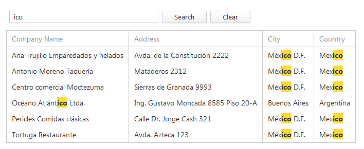
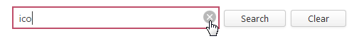
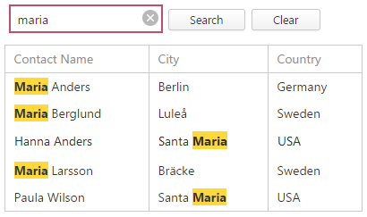
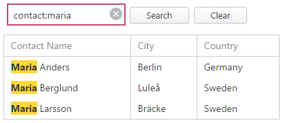
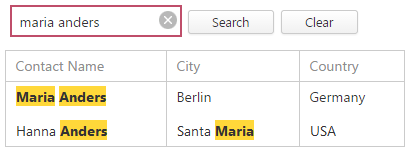
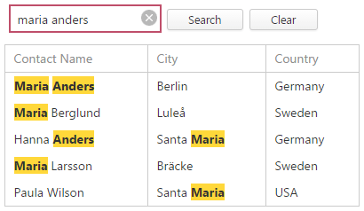
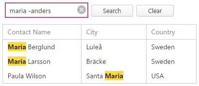
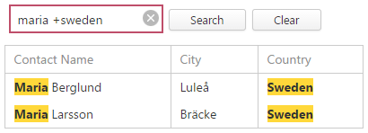

# Search Panel
To filter data and highlight search results, type a filter criterion in the search panel.

## Applying the Search Panel Filter Criterion
To apply a filter criterion typed in the search panel, press the ENTER key or click the **Search** button. Otherwise, a filter is automatically applied in 1.2 seconds.

## Clearing the Search Panel Filter Criterion
To clear the search panel filter criterion, do one of the following.
* Press DELETE or BACKSPACE.
* Click the **Clear** button.
* Click the clear button, which is displayed within the editor when the editor is focused and is not empty.
	
	

## Search syntax
In its simplest form, a search criterion consists of a single word. However, the search panel allows you to create composite criteria.
* **Mask:** criterion 
	
	 maria
	
	
	
	**Example description:** selects records that contain the "maria" string in any search column.
* **Mask:** column:criterion 
	
	contact:maria
	
	
	
	You can search against a specific column by preceding a search string with the column's caption plus a colon character. Instead of the complete caption, it is possible to use the initial characters of the caption. A search will be performed against the first column whose name starts with the specified substring. If you want to search against a column whose caption contains space characters, specify the column's display caption in quotation marks.
	
	If the search string contains multiple conditions separated by space characters, and at least one condition defines a search against a specific column, only records that match all of these conditions are shown (i.e., the conditions are combined by the AND logical operator).
	
	**Example description:** selects records that contain "maria" in the column that starts with "contact".
* **Mask:** criterion1 criretion2 
	
	maria anders
	
	**Option AND**
	
	
	
	**Option OR**
	
	
	
	Based on conditions provided by your application vendor, the search panel can search words separated by space characters in one of the following ways.
	
	**Option AND**
	
	Only records that match all of the conditions are shown (i.e., the conditions are combined by the AND logical operator).
	
	**Example description:** selects records that contain both "maria" AND "anders" strings in any search column.
	
	**Option OR**
	
	If there is no column specification, records that match at least one of these conditions are shown (i.e., the conditions are combined by the OR logical operator). If at least one condition defines a search against a specific column, only records that match all of these conditions are shown (i.e., the conditions are combined by the AND logical operator).
	
	**Example description:** selects records that contain either "maria" OR "anders" strings in any search column.
* **Mask:** "criterion with spaces" 
	
	"maria anders"
	
	
	
	If you want to search for a string containing a space character, specify this string in quotation marks.
	
	**Example description:** selects records that contain "maria anders" in any search column.
* **Mask:** criterion1 -criterion2
	
	maria -anders
	
	
	
	Precede a condition with "-" to exclude records that match this condition from the result set. There should be no space between the "-" sign and the condition.
	
	**Example description:** selects records that contain "maria", excluding records that contain "anders".
* **Mask:**
	
	 criterion1 +criterion2 
	
	maria +sweden
	
	
	
	Precede a condition with "+" to display only records that match this condition. The "+" specifier allows you to implement the logical AND operator. There should be no space character between the "+" sign and the condition.
	
	**Example description:** selects records that contain both "maria" AND "sweden" in search columns.