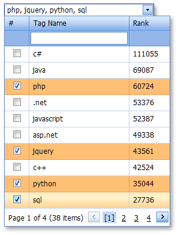

# Select Grid Lookup Rows
If multiple row selection is allowed by the application vendor, you can select multiple rows by doing one of the following.
* Click a row to toggle its selected state.
* If selection check boxes are visible, check rows that need to be selected.

