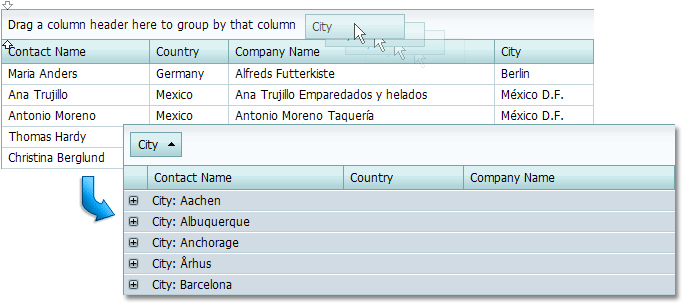
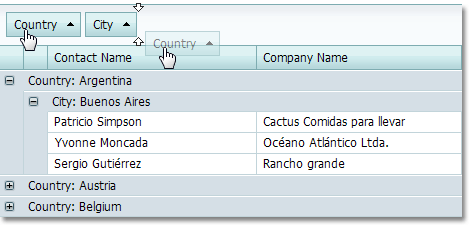

# Group Grid Rows
* Drag a column header from the column header panel to the group panel to group data.
	
	
* Move a column header within the group panel to change the group order.
	
	
* Drag a column header(s) from the group panel to the column header panel to ungroup data.

Use the [customization dialog](../customization-dialog/grouping-page.md) to group/ungroup grid data and change the order of grouping columns within the grid.