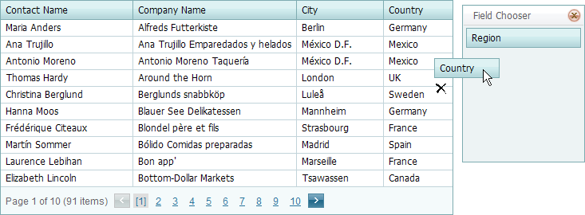

# Hide and Display Columns
Invoke the Field Chooser and drag a column's header onto it to hide the column.
	

	

Drag a column's header from the Field Chooser and drop it onto the column header panel to make the column visible.

## Customization Dialog
Use the [customization dialog](../customization-dialog/column-chooser.md) to change the order and visibility of data columns.
