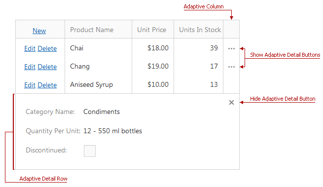

# Responsive Layout
The grid automatically hides columns one by one when the browser window is resized. When a grid has hidden columns, an ellipsis button (**Show Adaptive Detail** button) is displayed for every row.

You can see hidden data in the adaptive detail row. Click the ellipsis button (**Show Adaptive Detail** button) to expand a detail row. To hide a detail row, click the **Hide Adaptive Detail** button.