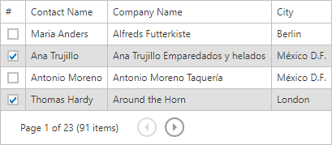

# Select Rows
## Using Row Clicks

Click a row while holding down the CTRL key to toggle the row's selected state. 

You can select contiguous rows by clicking the first row and the last row while holding down the SHIFT key. In this case the previous selection is cleared. You can further customize the selection by clicking individual rows while holding down the CTRL key.

## Using Check Boxes

Select and clear a check box to select and cancel the selection of the corresponding row. 

Select and clear the **Select All** check box to select and cancel the selection of all rows on the page (or all rows in the grid). 

