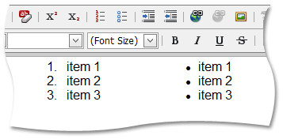

# Ordered and Bullet Lists
## Start a New List
Click a list button (**Ordered List**  or **Bullet List** ). Type in the first item, then press ENTER to create another item.

## Convert Existing Paragraphs into a List
1. Select the paragraphs you want to turn into a list.
2. Click the **Ordered List**  button to apply ordered list formatting to the text, or the **Bullet List**   button to create a bullet list.
3. Place the mouse pointer at the end of the last item and press ENTER to create a new list item.

