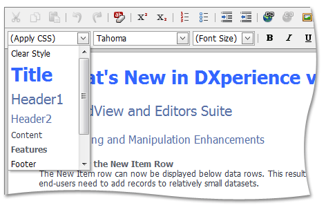

# Paragraph Styling
To apply a style, do the following.
1. Select the text you are going to format.
2. Click the **Apply CSS** dropdown button, to invoke a list of available paragraph styles.
3. Select the required style.

