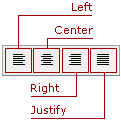

# Text Alignment
The editor allows users to apply the left, right, centered or justified alignment to the text. To change text alignment, do the following.
1. Place the mouse pointer onthe paragraph you are going to format, or select multple paragraphs.
2. Click the appropriate alignment button or press keyboard shortcut.

| Command  | Shortcut | Description |
|---|---|---|
| **Align Left** | Ctrl+L | Justifies text left |
| **Align Center** | Ctrl+E | Justifies text center |
| **Align Right** | Ctrl+R | Justifies text right |
| **Justify** | Ctrl+J | Justifies text |