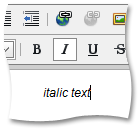

# Apply Italic Formatting
To apply italic formatting to a specific portion of the text, do the following.
1. Select the text you want to format.
2. Click the **Italic**  button or press Ctrl+I.

To remove italic formatting from the text, select the desired italic-formatted part of the text, and click the button again.

To type italic formatted text, click the **Italic**  button. To stop italic formatting, click the button again.