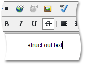

# Apply Strikethrough Formatting
To apply strikethrough formatting to a specific portion of the text, do the following:
1. Select the required part of the text (or the whole text).
2. Click the **Strikethrough**  button.

Note that if you want to remove strikethrough formatting from the text (which is already strikethrough-formatted), repeat the actions described above.

 To type strikethrough formatted text, click the **Strikethrough**  button. To stop formatting, click the button again.